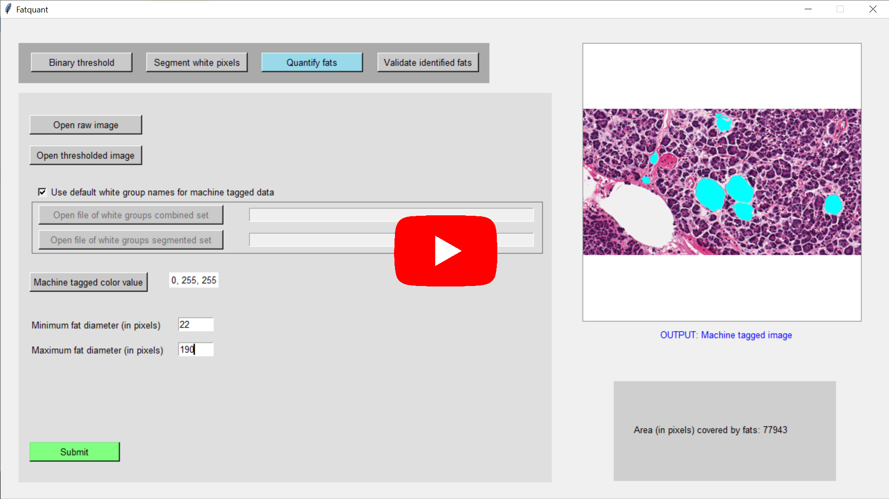

# Fatquant-GUI
This is a Windows based GUI application for the Fatquant tool. 
<!--  -->

Please read the document 'Tutorial.docx' before running the 'exe' file.

Video tutorial link:
<html>

  

</html>

The application was designed for the experiment mentioned in:
[https://www.sciencedirect.com/science/article/pii/S2667160323000133]

The individual Python programs and used images are available in:
[https://github.com/anniedhempe/Fatquant]
